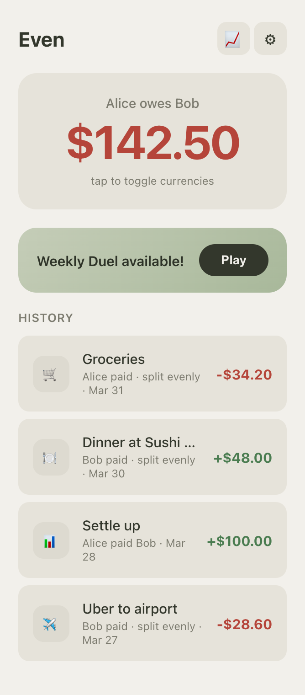
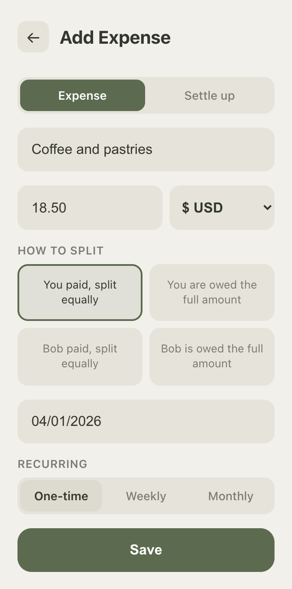

# Halfsies

A shared expense tracker for two people. Track who owes what, split costs, settle up — all in a lightweight PWA that works offline.

  
  &nbsp;&nbsp;
  

## Features

- **Expenses & Payments** — Log shared costs with descriptions, amounts, and currency. Settle up when ready.
- **Multi-Currency** — 30+ currencies with live exchange rates. Consolidated balance view converts everything to one currency.
- **Categories** — Automatic emoji categorization (groceries, dining, transport, etc.)
- **Recurring Expenses** — Set up weekly or monthly expenses that auto-create.
- **Weekly Duels** — Fun mini-games (coin flip, rock-paper-scissors, wheel spin, and more) that adjust your balance.
- **Insights** — Category breakdowns, spending trends, country stats, and fun facts about your shared expenses.
- **History** — Full timeline with search, edit, and CSV export.
- **PWA** — Install on your phone's home screen. Works offline with background sync.
- **Notifications** — Optional email alerts when your partner adds an expense (via EmailJS).

## Quick Start

1. Clone this repo
2. Open `setup.html` in your browser — the setup wizard walks you through everything
3. Deploy to any static host

Or see [SETUP.md](SETUP.md) for detailed manual instructions.

## Tech Stack

- **Frontend:** Vanilla JavaScript, HTML, CSS (no build step)
- **Database:** Firebase Firestore (real-time sync, offline support)
- **Auth:** Firebase Authentication (Google sign-in)
- **Notifications:** EmailJS (optional)
- **Hosting:** Any static host (Firebase Hosting, GitHub Pages, Netlify, Vercel)

## How It Works

Halfsies is designed for exactly two people. Both users sign in with Google, and Firestore rules ensure only those two accounts can access the data. All expenses are split between the two of you — either evenly or assigned in full to one person.

The balance shows how much one person owes the other across all currencies, with the option to view a consolidated total in a single currency using live exchange rates.

## Configuration

All settings live in a single `config.js` file (not committed to the repo). See `config.example.js` for the template. The setup wizard (`setup.html`) generates this file for you.

## License

[MIT](LICENSE)
